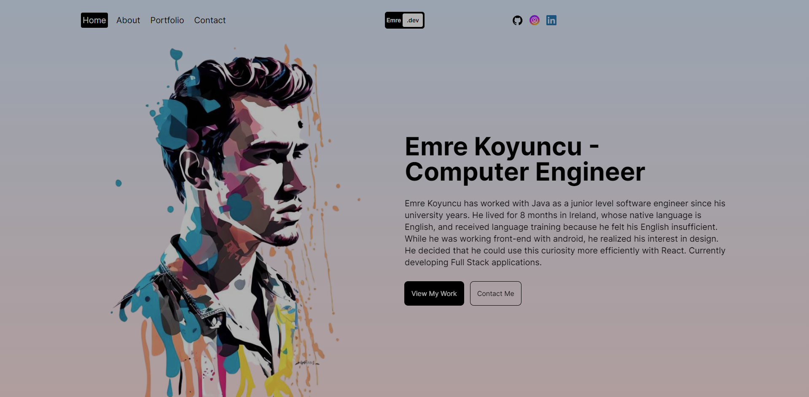

  <h1 align="center">Next.js Animated Portfolio</h1>

  

    An elegant, interactive showcase for your professional journey and projects
     
    
     
     
    <a href="https://github.com/emrekoyuncuu/nextjs-animated-portfolio/issues">Report Bug</a>
    ·
    <a href="https://github.com/emrekoyuncuu/nextjs-animated-portfolio/issues">Request Feature</a>
  

  

    
    
    
    
  

 

## 📋 Table of Contents

- [📋 Table of Contents](#-table-of-contents)
- [🚀 About The Project](#-about-the-project)
  - [Key Features](#key-features)
- [🛠️ Built With](#️-built-with)
- [🏁 Getting Started](#-getting-started)
- [💻 Usage](#-usage)
- [🗺️ Roadmap](#️-roadmap)
- [🤝 Contributing](#-contributing)
- [📧 Contact](#-contact)
- [🙏 Acknowledgements](#-acknowledgements)

## 🚀 About The Project

  

Next.js Animated Portfolio is a cutting-edge, responsive web application designed to showcase your professional journey, skills, and projects in a visually stunning and interactive manner. Leveraging the power of Next.js and Framer Motion, this portfolio template offers smooth animations, optimized performance, and an exceptional user experience across all devices.

### Key Features

- 🎨 **Eye-catching Animations**: Utilizes Framer Motion for fluid, engaging user interactions
- 📱 **Fully Responsive Design**: Ensures a flawless experience on devices of all sizes
- 🌓 **Dark/Light Mode**: Toggleable themes for comfortable viewing in any environment
- ⚡ **Optimized Performance**: Built with Next.js for lightning-fast load times and SEO benefits
- 📂 **Dynamic Project Showcase**: Easily update and display your latest work
- 📬 **Interactive Contact Form**: Seamlessly connect with visitors
- 🔍 **SEO Optimized**: Boost your online presence with search engine friendly structure

## 🛠️ Built With

This project leverages a powerful stack of modern web technologies:

- [Next.js](https://nextjs.org/)
- [React](https://reactjs.org/)
- [Tailwind CSS](https://tailwindcss.com/)
- [Framer Motion](https://www.framer.com/motion/)
- [TypeScript](https://www.typescriptlang.org/)

## 🏁 Getting Started

To get a local copy up and running, follow these simple steps:

1. Clone the repository
   ``sh
   git clone https://github.com/emrekoyuncuu/nextjs-animated-portfolio.git
   ``
2. Navigate to the project directory
   ``sh
   cd nextjs-animated-portfolio
   ``
3. Install dependencies
   ``sh
   npm install
   ``
4. Start the development server
   ``sh
   npm run dev
   ``
5. Open [http://localhost:3000](http://localhost:3000) in your browser to see the result

## 💻 Usage

Customize the portfolio to make it your own:

1. Update `public/logo.png` with your personal logo
2. Modify `components/Header.js` to adjust navigation items
3. Edit `pages/index.js` to personalize the hero section
4. Update project details in `pages/projects.js`
5. Customize the theme in `tailwind.config.js`

## 🗺️ Roadmap

See the [open issues](https://github.com/emrekoyuncuu/nextjs-animated-portfolio/issues) for a list of proposed features and known issues.

## 🤝 Contributing

Contributions are what make the open-source community such an amazing place to learn, inspire, and create. Any contributions you make are **greatly appreciated**.

1. Fork the Project
2. Create your Feature Branch (`git checkout -b feature/AmazingFeature`)
3. Commit your Changes (`git commit -m 'Add some AmazingFeature'`)
4. Push to the Branch (`git push origin feature/AmazingFeature`)
5. Open a Pull Request

## 📧 Contact

Emre Koyuncu - [LinkedIn](https://www.linkedin.com/in/emrekoyuncuu/) - emrekoyuncujob@gmail.com

Project Link: [https://github.com/emrekoyuncuu/nextjs-animated-portfolio](https://github.com/emrekoyuncuu/nextjs-animated-portfolio)

## 🙏 Acknowledgements

- [Next.js Documentation](https://nextjs.org/docs)
- [React Documentation](https://reactjs.org/docs/getting-started.html)
- [Tailwind CSS](https://tailwindcss.com/)
- [Framer Motion](https://www.framer.com/motion/)
- [Font Awesome](https://fontawesome.com)
- [Img Shields](https://shields.io)

  Made with ❤️ by <a href="https://github.com/emrekoyuncuu">Emre Koyuncu</a>

